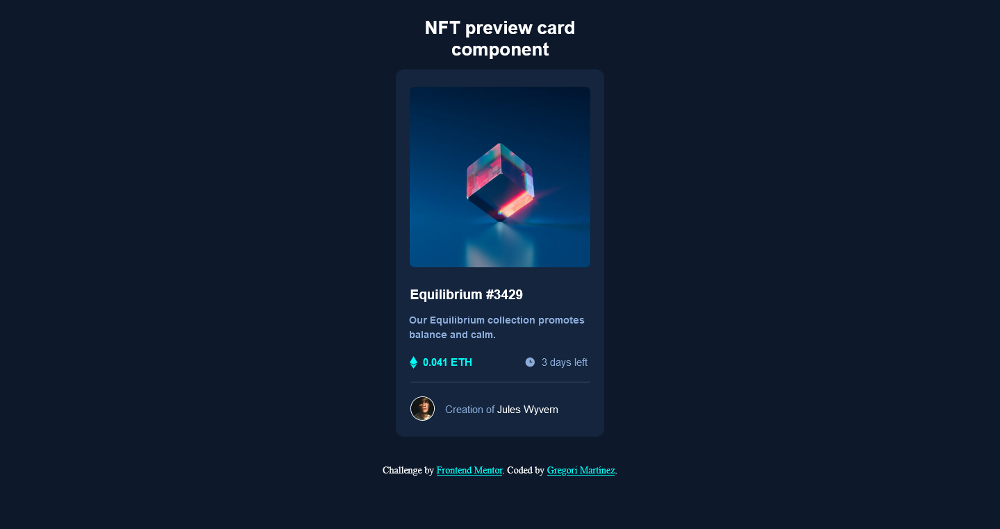

# Frontend Mentor - NFT preview card component solution

This is a solution to the [NFT preview card component challenge on Frontend Mentor](https://www.frontendmentor.io/challenges/nft-preview-card-component-SbdUL_w0U). Frontend Mentor challenges help you improve your coding skills by building realistic projects. 

## Table of contents

- [Overview](#overview)
  - [The challenge](#the-challenge)
  - [Screenshot](#screenshot)
  - [Links](#links)
- [My process](#my-process)
  - [Built with](#built-with)
  - [What I learned](#what-i-learned)
  - [Continued development](#continued-development)
  - [Useful resources](#useful-resources)
- [Author](#author)

## Overview

### The challenge

Users should be able to:

- View the optimal layout depending on their device's screen size
- See hover states for interactive elements

### Screenshot

Here, you can see a screenshot of the final result.

### Links

- Repository URL: [Click here](https://github.com/GregoriM04/nft-preview-card-component.git)
- Live Site URL: [Click here](https://your-live-site-url.com)

## My process

### Built with

- Semantic HTML5 markup
- CSS custom properties
- Flexbox
- CSS Grid
- Mobile-first workflow

### What I learned

I put into practice the 'mobile-first workflow' development on this project, and now I am able to say that it is much easier doing it this way rather than desktop-first, because I need to modify fewer things when scalling than vice versa.

### Continued development

I need to continue practicing how to position elements over the body, but, as always, practice makes perfect.

### Useful resources

- [Colored Overlay on Image Hover](https://wisdmlabs.com/blog/show-color-overlay-image-hover-using-css/) - On this page, I have learned a bit more about hover effect and how to use it over an image with CSS.

## Author

- LinkedIn - [Gregori Martinez](https://www.linkedin.com/in/gregorim04/)
- Frontend Mentor - [@GregoriM04](https://www.frontendmentor.io/profile/GregoriM04)
- Twitter - [@GregoriM04](https://twitter.com/GregoriM04)